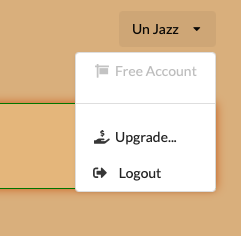
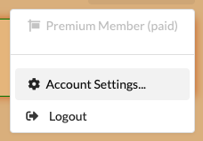
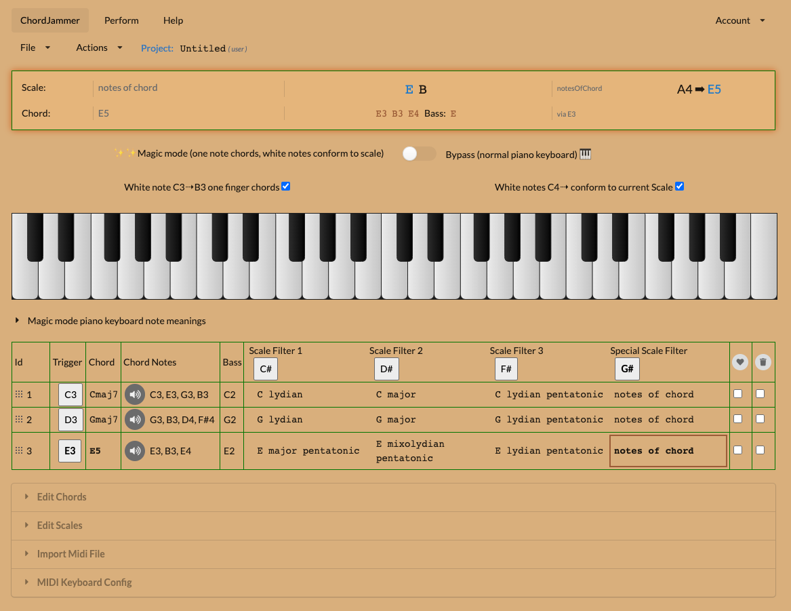
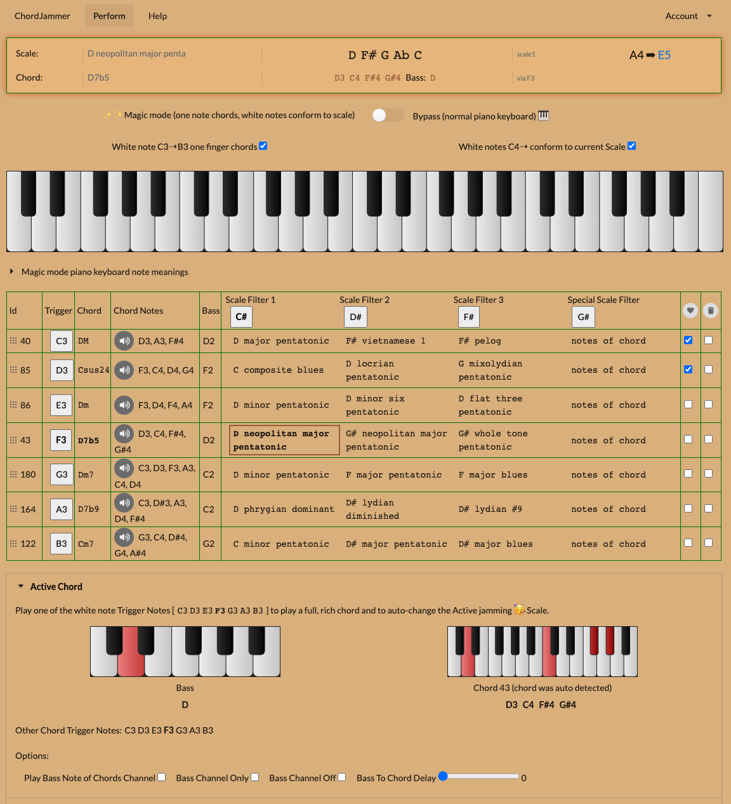

# Chord Jammer Project

A web app that lets you play chords with 1 finger in the left hand
and jam safely in the right hand.

As you change chords, the rh notes are filtered so you always play good sounding notes.

## How to use

- Visit https://chordjammer.web.app/

## Subscriptions

- You can subscribe to the app for $2/month to get access to more than three chords per project.  
<!-- A discounted rate of $20/year will also be available soon. -->

To upgrade, simply log into your free ChordJammer account and click the "Upgrade" button.

You will be taken to a secure Stripe payment page where you can enter your credit card details or use other payment methods.  You can cancel at any time using the account settings page.

## Screenshots

Main view, where you can edit your project.

Performance view, where you can play your project.

## Issues

To report issues, please use the github issue tracker.
https://github.com/abulka/chordjammer-public/issues
